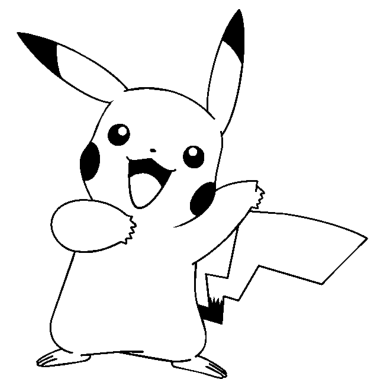
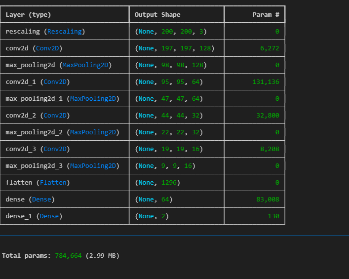
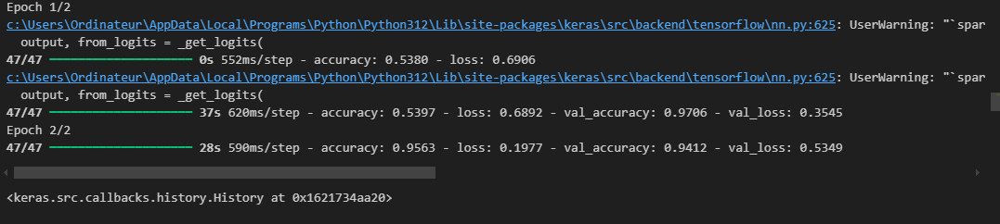
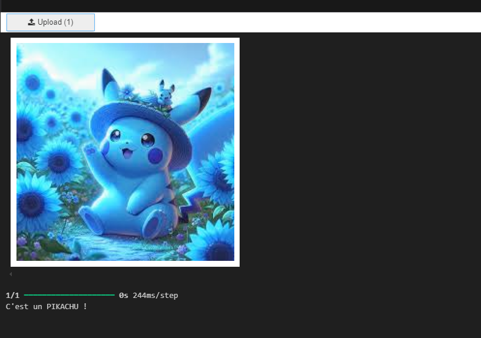
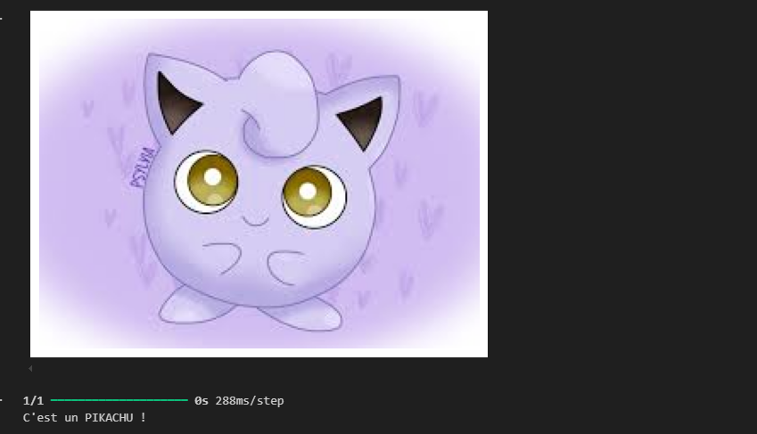
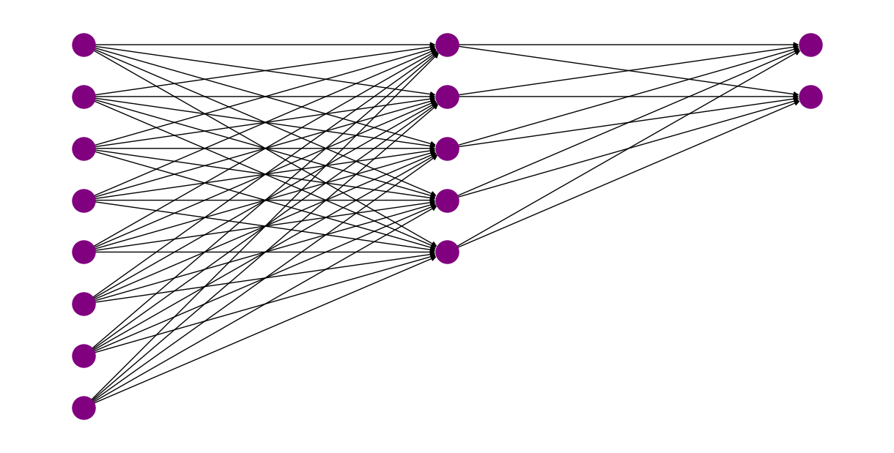

# README pour le projet de classification d'images Pokémon

# Groupe 7 :
- Lyes AIT TAYEB
- Rayne DZIRI
- Sofiane HAMMA
- Kevin TATA

## Introduction


Ce projet vise à construire un réseau de neurones convolutif (CNN) pour la classification d'images de différents Pokémon. Les fichiers *pikachu*, *randouou*, et *Pokemon* contiennent des photos spécifiques à chaque catégorie, servant de base de données pour entraîner et tester le modèle. Le projet est conçu pour explorer le fonctionnement des couches de convolution, clé des CNN, et comprendre leur rôle dans l'extraction de caractéristiques pertinentes des images.

### Exemples d'images utilisées
Voici quelques exemples d'images utilisées dans ce projet pour entraîner et tester le modèle :


### Qu'est-ce qu'une convolution dans les CNN ?

Les CNN sont des types de réseaux de neurones profonds spécialement conçus pour le traitement des données structurées en grille, comme les images. Une couche de convolution applique un filtre (ou noyau) sur l'image d'entrée, faisant ressortir des motifs spécifiques tels que des bords, des textures, ou des formes.

- **Convolution** : Les filtres appliqués glissent sur l'image, calculant des produits scalaires avec des sous-régions de l'image pour produire une carte de caractéristiques.
- **ReLU (Rectified Linear Unit)** : Fonction d'activation utilisée pour ajouter de la non-linéarité.
- **Pooling (Sous-échantillonnage)** : Technique pour réduire la dimension de la carte de caractéristiques, améliorant ainsi l'efficacité et réduisant le surapprentissage.

### Résumé de l'architecture du modèle
Voici un résumé des différentes couches utilisées dans le modèle CNN :


## Explication des étapes du projet

### 1. Préparation des données

Les dossiers *pikachu*, *randouou*, et *Pokemon* contiennent les images catégorisées selon le type de Pokémon. Ces fichiers sont prétraités pour être compatibles avec le modèle de CNN, comprenant :
- **Chargement des images**
- **Redimensionnement** pour uniformiser la taille
- **Normalisation** des pixels pour que les valeurs soient comprises entre 0 et 1

### 2. Structure du modèle de CNN

Le modèle est construit avec plusieurs couches, chaque couche jouant un rôle précis :
- **Couches de convolution** : Appliquent des filtres pour extraire des caractéristiques locales des images.
- **Couches d'activation (ReLU)** : Introduisent la non-linéarité.
- **Couches de pooling** : Réduisent la taille des cartes de caractéristiques tout en conservant les informations les plus importantes.
- **Couches denses (fully connected)** : Interprètent les caractéristiques extraites pour effectuer la classification finale.

### 3. Entraînement du modèle
Le modèle est entraîné avec les images des trois catégories. L'entraînement inclut :
- **La division des données en ensembles d'entraînement et de validation**
- **Le choix d'une fonction de coût et d'un optimiseur** (comme l'entropie croisée et l'optimiseur Adam)



### 4. Visualisation et résultats
Les performances du modèle sont évaluées sur l'ensemble de validation, et les résultats incluent des métriques telles que l'accuracy et la matrice de confusion. Voici une visualisation des caractéristiques intermédiaires :


## Explication détaillée du code

Chaque section du code est expliquée pour faciliter la compréhension :
1. **Chargement des bibliothèques** : Importation des modules nécessaires tels que *TensorFlow/Keras*, *NumPy*, et *Matplotlib*.
2. **Prétraitement des données** : Utilisation de scripts pour lire et préparer les images.
3. **Définition du modèle** :
   - Construction des couches convolutives et denses.
   - Compilation du modèle avec des paramètres optimaux.
4. **Entraînement et visualisation** :
   - Utilisation de `model.fit()` pour entraîner le modèle.
   - Affichage des courbes de perte et d'accuracy pour visualiser l'apprentissage.

### Résultats du modèle CNN

- **Prédictions du modèle** : Voici quelques exemples de prédictions réalisées par le modèle sur des images de Pokémon. L'algorithme identifie les images et retourne sa prédiction.
  

### Visualisation des erreurs du modèle
- **Erreurs de prédiction** : Cette image montre un exemple où le modèle a commis une erreur. Il est essentiel de comprendre où et pourquoi ces erreurs se produisent pour améliorer la performance du modèle.
  

### Visualisation des poids du réseau de neurones
- **Diagramme des poids du réseau** : Le graphique ci-dessous représente un exemple des connexions entre les neurones à travers les couches du modèle. Chaque point représente un neurone, et les lignes illustrent les connexions avec leurs poids.
  

  Code utilisé pour générer cette visualisation :
  ```python
  import matplotlib.pyplot as plt
  import networkx as nx
  
  # Créer un graphe avec NetworkX
  def draw_neural_network(layers):
      G = nx.DiGraph()
      pos = {}
      node_count = 0
      layer_count = 0
  
      for layer_size in layers:
          for neuron in range(layer_size):
              G.add_node(node_count)
              pos[node_count] = (layer_count, -neuron)
              node_count += 1
          layer_count += 1
  
      # Ajouter les connexions entre les neurones
      for i in range(len(layers) - 1):
          for j in range(layers[i]):
              for k in range(layers[i + 1]):
                  G.add_edge(j + sum(layers[:i]), k + sum(layers[:i + 1]))
  
      # Dessiner le graphe
      plt.figure(figsize=(12, 6))
      nx.draw(G, pos, with_labels=False, node_size=500, node_color="purple", edge_color="black", arrows=True)
      plt.show()
  
  # Exemple de réseau : 8 neurones d'entrée, 5 dans une couche cachée, et 2 en sortie
  layers = [8, 5, 2]
  draw_neural_network(layers)
  ```

---


## Conclusion

Ce projet démontre la puissance des CNN dans le domaine de la classification d'images en montrant comment ils peuvent extraire et apprendre des caractéristiques complexes. Grâce aux étapes détaillées de préparation, construction et évaluation, le modèle est capable de distinguer efficacement entre plusieurs types de Pokémon.
